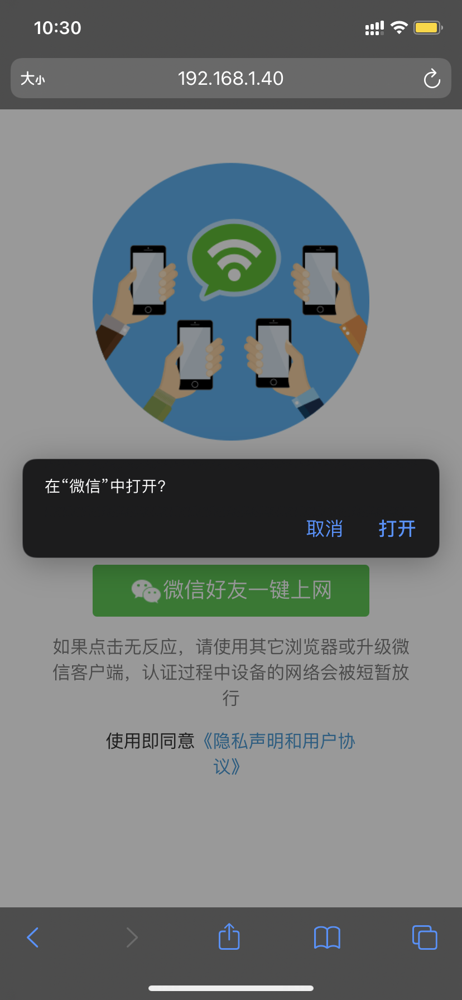

# WAVLINK AC1200 Router Unauthorized Access Vulnerability 2

### 0x01 Vulnerability description

A vulnerability is in the 'wx.html' page of the WAVLINK AC1200, version WAVLINK-A42W-1.27.6-20180418, which can allow a remote attacker to access this page without any authentication. When an unauthorized user accesses this page directly, it connects to this device as a friend of the device owner.

```
http://192.168.1.40/wx.html
```

### 0x02 Affected version

```
AC1200
```

### 0x03 PoC verification
Visiting the corresponding page directly through the mobile browser can reveal some key information about the device. Or you can get key information about the device by using the following command.





### 0x05 Acknowledgement

En-Ze Wang

Yi-Fei Gao

Zhen-Hua Wang

Wei Xie