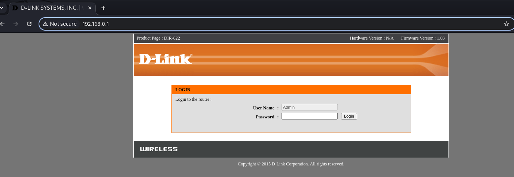
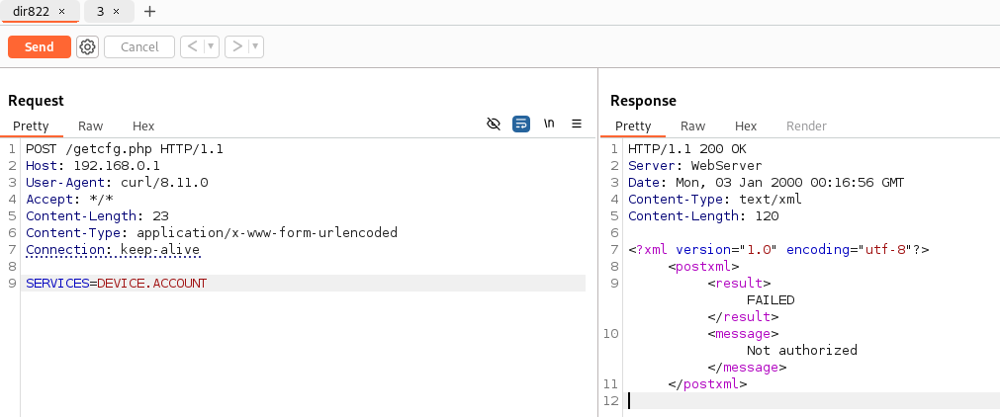
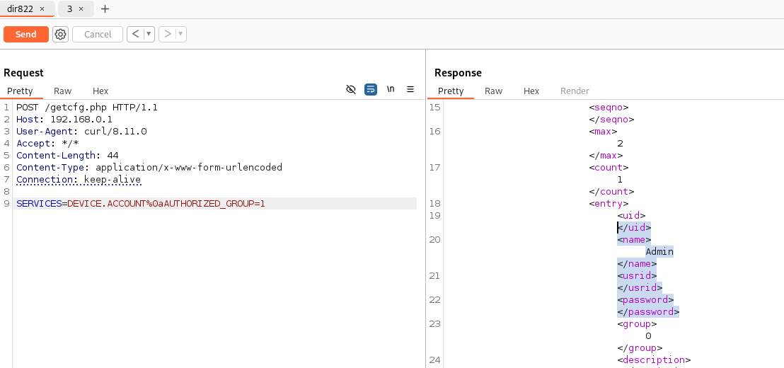

# D-Link Dir-822 ACL Bypass Vulnerability in `getcfg.php` Interface

## 0x01 Vulnerability Description

A critical ACL bypass vulnerability has been discovered in the `getcfg.php` web interface of D-Link Dir-822 devices. An attacker can bypass the access control mechanism by adding `%0aAUTHORIZED_GROUP=1` in the POST request parameters. When exploited, this vulnerability allows unauthorized access to sensitive device information, including login credentials, through the `getcfg.php` interface.

The vulnerability exists due to improper validation of POST request parameters, where a malformed request can trick the system into granting unauthorized access.

PoC:
```
curl -i "http://192.168.0.1/getcfg.php" -d "SERVICES=DEVICE.ACCOUNT%0aAUTHORIZED_GROUP=1"
```

## 0x02 Affected Version
```
D-Link Dir-822 (Firmware version 1.03 and previous versions)
```



## 0x03 Technical Analysis

Under normal circumstances, accessing the `getcfg.php` interface with a POST request containing `SERVICES=DEVICE.ACCOUNT` results in an "unauthorized" response, indicating that the access control mechanism is functioning properly.



However, when submitting a POST request with the parameter `SERVICES=DEVICE.ACCOUNT%0aAUTHORIZED_GROUP=1`, the interface returns sensitive account information. This indicates that:

1. The `%0a` (newline character) in the request causes improper parsing of the input parameters
2. The malformed request bypasses the authentication check
3. The `AUTHORIZED_GROUP=1` parameter is incorrectly interpreted as a valid authorization token



The successful exploitation of this vulnerability allows attackers to:
- Retrieve device account credentials
- Gain unauthorized access to sensitive configuration data
- Achieve full administrative access to the device

## 0x04 Security Impact

The vulnerability poses several serious security risks:
- Unauthorized access to device configurations
- Exposure of administrative credentials

## 0x05 Acknowledgement

Thanks to the partners who discovered the vulnerability together:

z3
