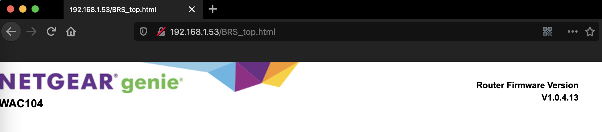

# Netgear W104 Bridge Repeater Unauthorized Access Vulnerability 1

### 0x01 Vulnerability description

A vulnerability is in the 'BRS_top.html' page of the Netgear W104, version WAC104-V1.0.4.13, which can allow a remote attacker to access this page without any authentication. When processed, it exposes firmware version information for the device.

```
http://192.168.1.53/BRS_top.html
```

### 0x02 Affected version

```
W104 =< V1.0.4.13
R7450 (All versions are affected)
R6900v2 (All versions are affected)
R7800 (All versions are affected)
R6220 =< V1.1.0.34_1.0.1
```

### 0x03 PoC verification
The corresponding target version can be found using the dork syntax of fofa.

```
"/BRS_top.html" && title=="NETGEAR Router R6220 "
```




The remaining versions of the vulnerability verification are the same as above.


### 0x05 Acknowledgement

En-Ze Wang

Yi-Fei Gao

Zhen-Hua Wang

Wei Xie