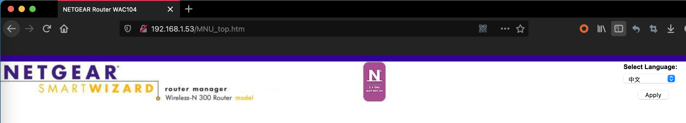

# Netgear W104 Bridge Repeater Unauthorized Access Vulnerability 2

### 0x01 Vulnerability description

A vulnerability is in the 'MNU_top.htm' page of the Netgear W104, version WAC104-V1.0.4.13, which can allow a remote attacker to access this page without any authentication. When processed, it exposes some key information for the device.

```
http://192.168.1.53/MNU_top.htm
```

### 0x02 Affected version

```
W104 =< V1.0.4.13
WNCE3001 (All versions are affected)
MBR1517v2 (All versions are affected)
```

### 0x03 PoC verification
The corresponding target version can be found using the dork syntax of fofa.

```
title=="NETGEAR Router MBR1517v2"
```



The information leaked varies from device to device, for example, MBR1517v2 leaks more information about the state of the device.


### 0x05 Acknowledgement

En-Ze Wang

Yi-Fei Gao

Zhen-Hua Wang

Wei Xie