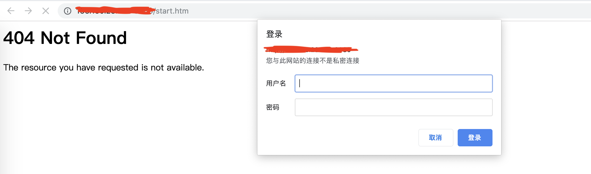

## 0x00 Vulnerability description

There are authentication bypass vulnerabilities in the web interface of some models of netgear devices. When the requested url ends with ".jpg", it will be recognized as an image without authentication.
An attacker can send a request to bypass authentication.

```
http://target/*.htm?x=1.jpg
or
http://target/*.cgi?A=a&B=b&...&x=1.jpg
```
The version difference is expressed as: Some models are only valid for cgi pages, not valid for htm pages; or only valid for Get mode, invalid for Post mode;  and it is difficult to find pages that are included in all models, constructing a generic PoC.

## 0x01 Exp usage example

Exp that does not disclose exploits temporarily.

## 0x02 Affected version
```
MBR1515
MBR1516
DGN2200
DGN2200M
DGND3700
WNR2000v2
WNDR3300
WNDR3400
WNR3500
WNR834Bv2
```

## 0x03 PoC verification
The corresponding target version can be found using the dork syntax of fofa.
```
app="NETGEAR-MBR1515"
```
Choose a target to test.
Direct access to `start.htm` can see that the display is unauthorized.


But when you visit `/start.htm?x=1.jpg`, you can see the corresponding page, but the reason for the authorization is because we are using this vulnerability to bypass the authorization of start.htm, the rest to be loaded. The page is still in an unauthorized state. So, if you add `?x=1.jpg` after each request, then all the interfaces can be displayed.


The remaining versions of the vulnerability verification are the same as above.

## 0x05 Acknowledgement

Thanks to the partners who discovered the vulnerability together：

z3