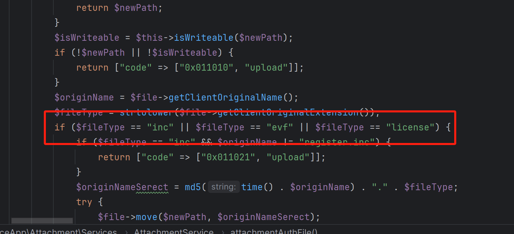
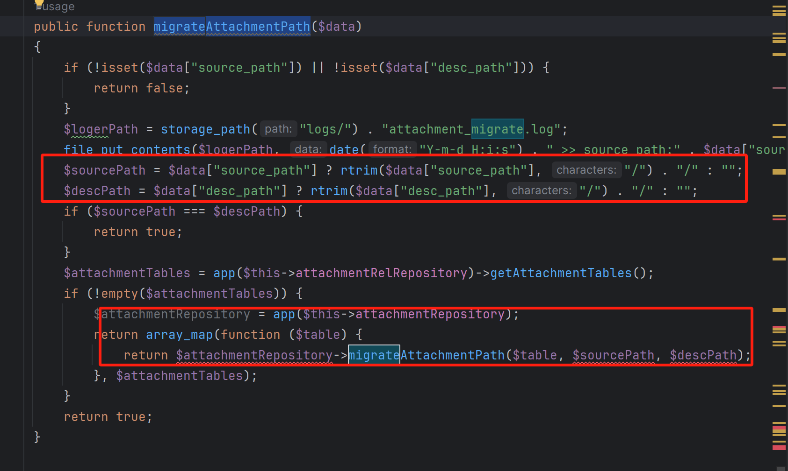
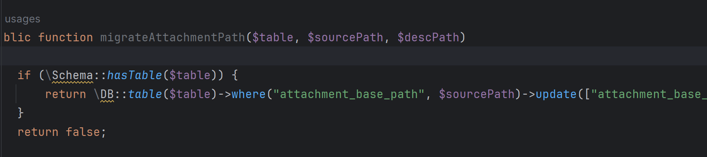
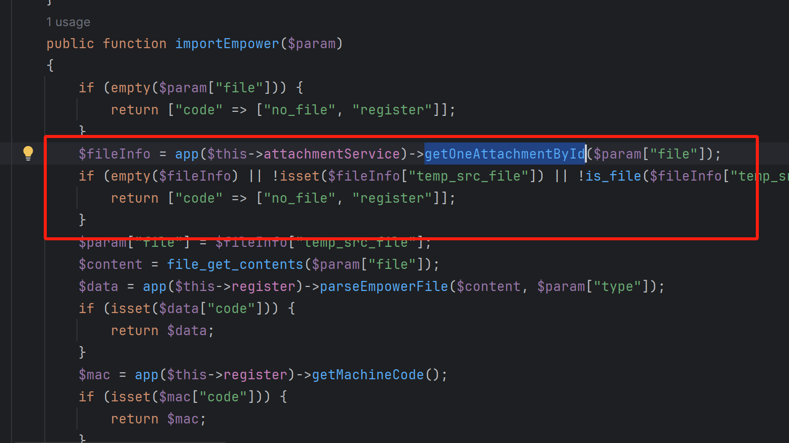
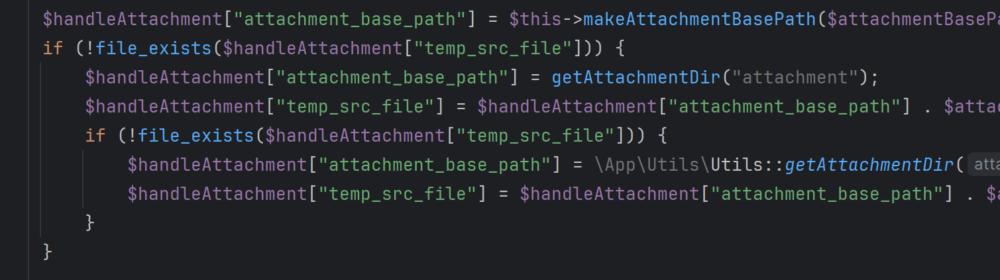
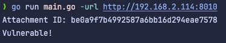

# Remote Code Execution Vulnerability in Weaver E-Office V 10

## 0x01 Affected version

vendor: https://www.e-office.cn/

version: Versions prior to v10 are vulnerable.

php version: 7.x

fofa query

```
app="泛微-EOffice" || (body="eoffice_loading_tip" && body="eoffice10")
```

## 0x02 Vulnerability description

The root cause of this vulnerability lies in the attacker's ability to upload phar-formatted files without proper authorization. Subsequently, the attacker can exploit the automatic deserialization mechanism triggered when PHP processes phar files. This exploitation enables the attacker to execute remote code on the targeted system, compromising its security and integrity.

#### 0x21 Restricted phar file uploads

`attachmentAuthFile`, method `service->attachmentAuthFile` You can see that the program only checks the suffix of the filename, and you can upload a file in phar format without identity verification.




#### 0x22 Trigger Phar deserialization

Attachment path changes in `AttachmentService.php#migrateAttachmentPath` are made by changing the path stored in the database without any checksum, i.e. updating it to the database.



The importEmpower function simply finds the path from the database based on the id, and then uses the file_exists function to determine if the file exists, which triggers the vulnerability.





## 0x03 PoC

 You can run the attached main.go to test the site for the threat of this vulnerability

```
go run main.go -url http://vuln.com
```



## 0x04 Mitigation

Please update the app to the latest version as soon as possible


